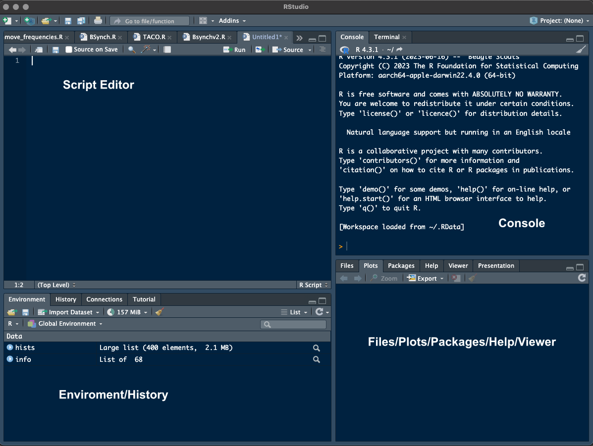

# Introduction to R Programming
by Dr. Marco A. Aquino López

## Course Outline

### [Section 1: Getting Started with R](#section-1)
  - [Introduction to R and its applications](#introduction-to-r)
  - [Installing R and RStudio](#installing-r-and-rstudio)

### [Section 2: Understanding the R Environment](#section-2)
  - [Overview of the RStudio Interface](#overview-rstudio-interface)
  - [Basic R syntax and operations](#basic-r-syntax)

### [Section 3: Data Manipulation and Analysis in R](#section-3)
  - [Understanding R Data Structures](#undetanding-r-data-structures)
  - [Data Cleaning and Preprocessing](#data-cleaning)
  - [Exploratory Data Analysis (EDA)](#exploratory-data-analysis)
  
### [Section 4: Looping Constructs in R](#section-4)
  - [For Loops](#for-loops)
  - [While Loops](#while-loops)
  - [Best Practices for Using Loops](#best-practices-for-using-loops)
  - [Exercise: Using Loops](#exercise-using-loops)


---

## Section 1: Getting Started with R

### Introduction to R and its applications

R is a powerful language and environment for statistical computing and graphics. It is highly extensible and provides a wide variety of statistical and graphical techniques, including linear and non-linear modelling, classical statistical tests, time-series analysis, classification, clustering, and more.

One of the primary reasons R is so useful for data analysis is its extensive repository of packages. The Comprehensive R Archive Network (CRAN), for instance, hosts thousands of packages that extend the functionality of R, making it a tool that can handle almost every kind of data analysis task. Moreover, the R community is very active, meaning that it's easy to find help and resources online.

#### A Quick Historical Fact
R was created by Ross Ihaka and Robert Gentleman at the University of Auckland, New Zealand, and is currently developed by the R Development Core Team. The name partly stands for the first names of the first two R authors and also plays on the name of the Bell Labs Language 'S'. R was officially announced on August 3, 1993, and has since become one of the most popular languages for data analysis and statistical modelling.

### Installing R and RStudio

#### Windows
1. Visit the Comprehensive R Archive Network (CRAN) at [https://cran.r-project.org/](https://cran.r-project.org/).
2. Click on the link 'Download R for Windows'.
3. Click on 'install R for the first time'.
4. Download the latest version of R for Windows by clicking on the link at the top of the page.
5. Run the downloaded .exe file and follow the on-screen instructions to install R.

#### macOS
1. Visit CRAN at [https://cran.r-project.org/](https://cran.r-project.org/).
2. Click on the link 'Download R for (Mac) OS X'.
3. Select the .pkg file for the latest version of R under "Files."
4. Download the package and double-click it to open the installer.
5. Follow the installation instructions to install R on your Mac.

#### Linux
For Linux users, the installation process varies by distribution. Below are instructions for Debian/Ubuntu-based distributions and Fedora/Red Hat-based distributions.

- Debian/Ubuntu
  1. Open a terminal window.

  2. Update the package list:
     ```sh
     sudo apt update
     ```
  3. Install R by executing:
     ```sh
     sudo apt install r-base
     ```

- Fedora/Red Hat
  1. Open a terminal window.
  2. Install the EPEL repository, if not already installed:
     ```sh
     sudo yum install epel-release
     ```
  3. Install R by executing:
     ```sh
     sudo yum install R
     ```
     
Replace `yum` with `dnf` in the above commands if you are on a newer Fedora version that uses DNF.

For other distributions, you should check the specific instructions based on the package manager and repository configurations for your system. It's always good practice to consult the official R documentation or community forums for the most accurate and up-to-date instructions..


### Installing RStudio

After installing R, you can also install RStudio, which is an integrated development environment (IDE) for R. It provides a user-friendly interface and additional tools to work with R more effectively.

#### Windows
1. Go to the RStudio download page at [https://www.rstudio.com/products/rstudio/download/](https://www.rstudio.com/products/rstudio/download/).
2. Under the **Installers for Supported Platforms** section, click on the link that says "Windows 10/11" to download the installer for Windows.
3. Once downloaded, run the RStudio installer `.exe` file.
4. Follow the on-screen instructions to complete the installation.

#### macOS
1. Navigate to the RStudio download page at [https://www.rstudio.com/products/rstudio/download/](https://www.rstudio.com/products/rstudio/download/).
2. In the **Installers for Supported Platforms** section, click on the "Mac OS X 10.14+ (64-bit)" link to download the installer for macOS.
3. After the download is complete, open the `.dmg` file by double-clicking it.
4. Drag the RStudio icon to your Applications folder to install it.

#### Linux
1. Visit the RStudio download page at [https://www.rstudio.com/products/rstudio/download/](https://www.rstudio.com/products/rstudio/download/).
2. Scroll down to the **Installers for Supported Platforms** section.
3. Download the appropriate installer for your Linux distribution (Ubuntu, Fedora, RedHat, or openSUSE). There will typically be a `.deb` file for Debian/Ubuntu-based distributions and an `.rpm` file for Fedora/RedHat-based distributions.
4. For Debian/Ubuntu-based systems, install RStudio using the following terminal command, replacing "filename.deb" with the name of the file you downloaded:
    ```sh
   sudo dpkg -i filename.deb
   ```
    If you encounter missing dependencies, resolve them with:
    ```sh
   sudo apt-get install -f
    ```
5. For Fedora/Red Hat-based systems, use the following command, replacing "filename.rpm" with the name of the file you downloaded:
    ```sh
   sudo yum install filename.rpm
   ```
    or for newer systems using DNF:
   ```sh
   sudo dnf install filename.rpm
    ```

Ensure that you have installed R before installing RStudio, as RStudio requires R to be present on the system. After installing both R and RStudio, you can launch RStudio and begin using it for your R programming tasks.

---

## Section 2: Understanding the R Environment

### Overview of the RStudio Interface

RStudio is designed to make using R easier and more productive. Here's an overview of the main components of the RStudio interface:

- **Console**: The console in RStudio is where R scripts are executed line-by-line. It is also where you will see output from commands that have been run.

- **Script Editor**: This is where you can write, edit, and save R scripts. Scripts can be run entirely or in sections directly from the editor.

- **Environment/History**: The environment tab shows the current working data sets and variables in memory and the history tab shows the list of commands that have been previously entered.

- **Files/Plots/Packages/Help/Viewer**: This pane allows you to navigate through your project's files, view plots that you have generated, install and load packages, access R's built-in help system, and use the web viewer to display HTML content.


<!---->


Each pane can be resized, and you can even customize further by choosing which panes appear and where they are situated.


#### Basic R syntax and operations

R's syntax is quite flexible and allows for various operations that are essential for data analysis. It's crucial for beginners to understand the foundational syntax to build upon as they progress. Here's an overview of the basic R syntax and operations that every R user should be familiar with:

- **Assignment**: In R, you can assign values to variables using the `<-` operator. For example: `x <- 10` assigns the value 10 to the variable `x`.
- **Functions**: Functions are called using the syntax `function_name(arguments)`. For example, `mean(x)` calculates the average of the elements in `x`.
- **Vectors**: You can create a vector using the `c()` function, such as `v <- c(1, 2, 3, 4)`.
- **Matrices**: Matrices can be created using the `matrix()` function, with data arranged by row or by column.
- **Data Frames**: Data frames are created using the `data.frame()` function and are used to store tabular data.
- **Lists**: Lists are a more complex data structure, created using the `list()` function, that can hold a collection of objects of varying types and lengths.

#### Basic Operations

- **Arithmetic Operations**: R supports standard arithmetic operations like addition (`+`), subtraction (`-`), multiplication (`*`), division (`/`), and exponentiation (`^`).
- **Logical Operations**: Logical operators include `>`, `<`, `==`, `!=`, `<=`, `>=`, and are used to compare values.
- **Data Manipulation**: You can subset, extract, and manipulate data using operators like `[ ]`, `[[ ]]`, and `$`.
- **Control Structures**: Use control structures such as `if`, `else`, `for`, `while`, and `repeat` to direct the flow of execution in your script.

#### Recommendations for Learning Basic R Syntax

- **Interactive Tutorials**: Use online platforms like DataCamp, Codecademy, or Swirl in R, which provide interactive lessons and exercises.
- **Practice**: Engage with exercises that challenge you to write simple functions, manipulate data structures, and implement control structures.
- **Readability**: Write code that is easy to read and understand. Use comments (`#`) to describe what your code is doing, which is essential for collaboration and debugging.
- **Consistency**: Stick to a consistent style of coding, such as using the same type of assignment operator throughout your code (`<-` or `=`).

By starting with these basic concepts and practices, new R users can rapidly gain confidence in manipulating data and performing analyses in R.

---

### Exercise 1: Variable Assignment and Arithmetic Operations

**Objective**: Create variables and perform arithmetic operations to solve a simple problem.

- Assign the value 50 to a variable named 'sales_day1' and 70 to 'sales_day2'.
- Calculate the total sales for both days and assign it to 'total_sales'.
- Calculate the average sales and assign it to 'average_sales'.
- Print out 'total_sales' and 'average_sales'.

**Expected Outcome**: You will demonstrate how to assign values to variables and perform basic arithmetic operations like addition and division.

### Exercise 2: Vector Creation and Operations

**Objective**: Create vectors and perform operations to find specific values.

- Create a vector 'temperatures' with the following values: 23, 20, 21, 22, 24.
- Find the maximum temperature and assign it to 'max_temp'.
- Find the minimum temperature and assign it to 'min_temp'.
- Calculate the difference between 'max_temp' and 'min_temp' and print the result.


**Expected Outcome**: You will practice creating vectors and using built-in functions to perform operations on vectors.

### Exercise 3: Conditional Execution and Functions

**Objective**: Write a simple function and use conditional logic to make decisions.

- Write a function 'grade_result' that takes a numeric grade (0-100) as input.
- Inside the function, print "Pass" if the grade is 50 or above, and "Fail" if below 50.
- Test the function with grades: 49, 85, and 60.

```r
grade_result <- function(grade) {
  # Your code here
}

# Test cases
grade_result(49)
grade_result(85)
grade_result(60)
```

**Expected Outcome** You will understand how to create a function, implement an `if-else` conditional structure, and test the function with different inputs.

---

## Section 3: Data Manipulation and Analysis in R

### Understanding R Data Structures

In this section, we'll delve into the fundamental data structures in R: vectors, matrices, and data frames. Understanding these structures is essential as they are the building blocks for data manipulation and analysis in R.

#### Vectors

Vectors are the simplest type of data structure in R. They contain items of the same type (numeric, character, or logical). You can create a vector using the `c()` function.

```r
# Numeric vector
numeric_vector <- c(1, 2, 3, 4, 5)

# Character vector
character_vector <- c("apple", "banana", "cherry")

# Logical vector
logical_vector <- c(TRUE, FALSE, TRUE)
```

Extracting elements from a vector in R is straightforward and can be done using indexing as well. In R, you can access elements in a vector by their position within the vector, using square brackets `[]`.

Here's a quick guide on how to extract elements from a vector:

- **Single Element**: To get the first element of the vector, you use `my_vector[1]`.
- **Multiple Elements**: To get the first and third elements, use `my_vector[c(1, 3)]`.
- **Sequence of Elements**: To get the first through third elements, use `my_vector[1:3]`.
- **Excluding Elements**: To exclude certain elements, such as the second one, use `my_vector[-2]`.

Here is an example using a vector of the first 5 positive integers:

```r
# Creating a vector with the first 5 positive integers
my_vector <- c(1, 2, 3, 4, 5)

# Extract the first element
first_element <- my_vector[1]

# Extract the first and third elements
some_elements <- my_vector[c(1, 3)]

# Extract the first through third elements
sequence_elements <- my_vector[1:3]

# Extract all but the second element
excluding_element <- my_vector[-2]
```

Remember, in R, indexing starts at 1, not 0 as in some other programming languages. This means `my_vector[1]` gives you the first element, not the second.

Vectors are one of the most basic data structures in R, and indexing is an essential operation that you'll use frequently for data manipulation and analysis tasks.


#### Matrices

Matrices are two-dimensional, rectangular data structures that can hold elements of a single data type. You can create a matrix using the `matrix()` function.

```r
# Matrix with 2 rows and 3 columns
my_matrix <- matrix(1:6, nrow = 2, ncol = 3)
```

Extracting elements from a matrix in R can be done using indexing. Here’s a brief explanation:

A matrix in R is a two-dimensional array that has a set number of rows and columns. You can access its elements using the `[row, column]` indexing notation. If you want to extract a single element, you provide its row and column indices inside the square brackets. If you want to extract multiple elements, such as a whole row or column, you provide the index of the row or column and leave the other index blank.

Here's how you can extract elements from a matrix:

- **Single Element**: To get the element from the first row and second column, you use `my_matrix[1, 2]`.
- **Entire Row**: To get the entire first row, use `my_matrix[1, ]`.
- **Entire Column**: To get the entire second column, use `my_matrix[, 2]`.
- **Submatrix**: To get a smaller matrix, for example, the elements from the first and second rows and the first and second columns, use `my_matrix[1:2, 1:2]`.

Additionally, you can use logical vectors to index matrices. For example, if you want to extract all elements greater than a certain value, you can use `my_matrix[my_matrix > value]`.

Here is an example with a 3x3 matrix:

```r
# Creating a 3x3 matrix
my_matrix <- matrix(c(1, 2, 3, 4, 5, 6, 7, 8, 9), nrow = 3)

# Extract the element in the second row, third column
element <- my_matrix[2, 3]

# Extract the second row
second_row <- my_matrix[2, ]

# Extract the third column
third_column <- my_matrix[, 3]

# Extract a submatrix (first two rows and columns)
sub_matrix <- my_matrix[1:2, 1:2]
```

Understanding how to manipulate and extract information from matrices is a fundamental skill in R programming, especially when working with multi-dimensional datasets.


#### Data Frames

Data frames are used to store tabular data. They can hold different types of data in different columns, much like a spreadsheet or SQL table.

```r
# Data frame with three columns
my_data_frame <- data.frame(
  ID = 1:3,
  Name = c("John", "Jane", "Doe"),
  Age = c(28, 34, 45)
)
```

Accessing elements within a data frame in R involves a similar approach to vectors and matrices, but with some additional considerations since data frames can contain different types of data in each column.

Here’s how to extract elements from a data frame:

- **Single Element**: Use the `[row, column]` notation, specifying both row and column indices to get a single element. Example: `my_data_frame[2, 3]` would get the element in the second row and third column.
- **Entire Row**: Provide the row index and leave the column index blank. Example: `my_data_frame[1, ]` would retrieve the entire first row.
- **Entire Column**: Two common ways to do this are:
  - By column index: `my_data_frame[, 2]` would retrieve the second column.
  - By column name: `my_data_frame$column_name` or `my_data_frame[["column_name"]]` would retrieve the column named `column_name`.
- **Subset of Rows/Columns**: Combine row and column indices to retrieve a subset. Example: `my_data_frame[1:3, c("column1", "column2")]` would get the first three rows of `column1` and `column2`.

You can also use logical conditions to subset a data frame. For example, to retrieve all rows where the value in a certain column meets a condition:

```r
subset_rows <- my_data_frame[my_data_frame$column_name > 10, ]
```

Here's a practical example using a data frame:

```r
# Creating a simple data frame
my_data_frame <- data.frame(
  ID = 1:4,
  Name = c("Alice", "Bob", "Charlie", "Dana"),
  Score = c(85, 93, 88, 91)
)

# Extract the name of the second student
second_name <- my_data_frame[2, "Name"]

# Extract all scores
scores <- my_data_frame$Score

# Extract the first three rows
first_three_rows <- my_data_frame[1:3, ]

# Extract rows where the score is greater than 90
high_scores <- my_data_frame[my_data_frame$Score > 90, ]
```

In R, the `$` operator is particularly useful for accessing columns directly by name, making your code more readable and less prone to errors due to column position changes.

Understanding how to access data within data frames is crucial because data frames are one of the most commonly used data structures in R for storing and manipulating data sets.


#### Exercise: Manipulating and Extracting Information

1. Create a vector of the first 10 even numbers and extract the second half of the vector using indexing.
2. Construct a 3x3 matrix with numbers from 1 to 9 and then extract the second row.
3. Build a data frame with two columns: `month` and `temperature`, representing monthly average temperatures. Then, select the temperature for the month of July.

**Expected Outcome**:
- For the vector, you should have a subset containing the last 5 even numbers.
- For the matrix, the second row should be displayed as a vector.
- For the data frame, the temperature value for July should be returned.

```r
# Vector manipulation
even_numbers <- seq(2, 20, by = 2)
second_half <- even_numbers[6:10]

# Matrix manipulation
my_matrix <- matrix(1:9, nrow = 3)
second_row <- my_matrix[2, ]

# Data frame manipulation
months <- c("January", "February", "March", "April", "May", "June", "July")
temperatures <- c(3, 4, 9, 14, 19, 23, 27)
my_data_frame <- data.frame(month = months, temperature = temperatures)
july_temp <- my_data_frame$temperature[my_data_frame$month == "July"]
```

By completing this exercise, you will practice creating and manipulating the three main data structures in R, which will be the cornerstone of their data analysis tasks.


### Data Cleaning and Preprocessing

Data rarely comes in clean and ready-to-analyze formats. As such, data cleaning and preprocessing form the foundational steps in data analysis with R, turning raw data into a format that can be analyzed to extract meaningful insights.

#### Understanding Data Cleaning

The process of data cleaning involves identifying and correcting errors and inconsistencies in data to improve its quality. This might include:

- **Dealing with Missing Values**: Missing data can skew results. In R, you can find missing values with `is.na()` and decide whether to fill them in (imputation) or remove them.
- **Outlier Detection**: Outliers are data points that are significantly different from others. They can be detected through various methods, including statistical tests or visualization techniques.
- **Data Formatting**: Ensuring data is in the correct format is crucial. For example, dates should be in a date format, and categorical data should be in a factor or character format.

#### Steps in Preprocessing Data

Preprocessing involves getting your dataset ready for analysis. It includes:

- **Data Type Conversion**: Sometimes you need to convert data from one type to another, like turning a character string into a date with `as.Date()`, or a numeric value into a categorical variable with `as.factor()`.
- **Data Transformation**: This might involve creating new variables or modifying existing ones, such as calculating the log of a variable for better scaling.
- **Subsetting Data**: You might not need every row or column in your dataset. Subsetting allows you to focus on the data that's relevant for your analysis.

#### Tools in R for Data Cleaning and Preprocessing

- **Base R Functions**: R comes equipped with functions like `str()` to understand the structure of your data and `subset()` for slicing data.
- **The Tidyverse Suite**: A collection of R packages designed for data science. `dplyr`, for instance, provides a grammar for data manipulation, and `tidyr` helps in tidying your data.

### Exercise

Try out some basic data cleaning with a simple vector:

```r

# Create a vector with some numbers and one NA (which stands for "Not Available" and represents a missing value in R)
numbers <- c(1, 2, NA, 4, 5)

# Check for missing values
is.na(numbers)

# Remove the missing values
clean_numbers <- na.omit(numbers)

# Convert numeric data to categorical
factor_numbers <- as.factor(clean_numbers)

```

Through these steps, you’ll start to grasp the importance and basics of data cleaning and preprocessing in R. With practice, you’ll be able to prepare your data for any analysis effectively.


### Exploratory Data Analysis (EDA)

Exploratory Data Analysis, commonly known as EDA, is a critical step in the data analysis process. The main purpose of EDA is to explore the data's structure, patterns, anomalies, and variables' relationships with each other. In R, EDA is an interactive process that often involves visualization and statistical summaries.

#### Key Components of EDA

- **Summary Statistics**: These provide a quick look at the measures of central tendency and spread, such as mean, median, range, and standard deviation. In R, you can use the `summary()` function to obtain these statistics.
- **Data Visualization**: Visuals can reveal trends and patterns that statistics alone might not uncover. Even simple plots, like histograms or scatter plots using R's `hist()` or `plot()` functions, can be very informative.
- **Understanding Distributions**: Looking at how data points are distributed across variables. For instance, using `boxplot()` can help identify outliers and the quartiles of the data.

#### Conducting EDA in R

1. **Inspecting the Data Structure**: Use the `str()` function to understand the structure of your dataset, like the types of variables you have and if they're in the correct format.

2. **Checking Summary Measures**: Apply the `summary()` function on your dataset to get a quick statistical summary of the variables.

3. **Visual Exploration**: Start with simple plots:
   - `plot()` to see relationships between two variables.
   - `hist()` to check the distribution of a single variable.
   - `boxplot()` to understand the distribution and spot potential outliers.

4. **Correlation Analysis**: Use `cor()` to check the correlation between numeric variables. This informs us about the degree to which variables are linearly related.

#### Best Practices for EDA

- **Start Simple**: Begin with basic plots and statistics before moving to more complex analysis.
- **Iterative Process**: EDA is not a linear process. You may need to go back and forth, tweak your analysis, and look at your data from different angles.
- **Document Your Findings**: Keep track of your observations and thoughts as you go through the EDA process. This documentation can be crucial for subsequent analysis steps or when sharing your findings with others.

### Exercise

Get a feel for EDA by analyzing a built-in dataset in R:

```r
# Load the 'mtcars' dataset, which comes pre-loaded in R
data(mtcars)

# View the structure of the dataset
str(mtcars)

# Generate summary statistics
summary(mtcars)

# Create a simple histogram to see the distribution of miles per gallon (mpg)
hist(mtcars$mpg)

# Create a boxplot to explore the distribution of car weights
boxplot(mtcars$wt)

# Check the correlation between 'mpg' and 'hp' (horsepower)
cor(mtcars$mpg, mtcars$hp)

```
### Using an alternative method
Violin plots are a method for visualizing the distribution of numerical data, useful for comparing multiple groups. They combine features from box plots and kernel density plots to show the density of the data at different values. This makes them valuable for seeing the full range of the data and understanding the density of the data points.

We'll use violin plots to learn how to install new packages in R and to visually compare data distributions. It's a practical example to illustrate how additional packages can extend R's capabilities.


####  Installing and Using the `vioplot` Package for Violin Plots

The `vioplot` package is a convenient tool for creating violin plots in R, which are useful for visualizing the distribution of a dataset. To begin using `vioplot`, you must first install it. This is done by running the following command in your R console:

```r 
install.packages("vioplot")
```

This command reaches out to the CRAN repository and installs the latest version of the `vioplot` package along with any dependencies it requires.

#### Loading the `vioplot` Package

Once the package is installed, you need to load it into your R session to access its functions. This is done with the `library` function:

```r 
library(vioplot)
```

After loading the package, you can now use the `vioplot()` function to create violin plots.

#### Creating a Violin Plot with `vioplot`

To create a violin plot, you'll need numerical data that you wish to examine. In our example, we're using the built-in `mtcars` dataset and looking at the distribution of miles per gallon (mpg) across different groups of cylinder counts (cyl). Here’s a quick recap on how to create a violin plot with `vioplot`:

```r
# Ensure that the 'cyl' variable is a factor
mtcars$cyl <- as.factor(mtcars$cyl)

# Split the 'mpg' data based on 'cyl' factor levels
mpg_data <- split(mtcars$mpg, mtcars$cyl)

# Use the vioplot function to create the plot
vioplot(mpg_data[[1]], mpg_data[[2]], mpg_data[[3]],
        names = c("4 cylinders", "6 cylinders", "8 cylinders"),
        col = "lightblue")

# Add a title to the plot
title("Violin plot of MPG by Number of Cylinders")

```

By running this code in your R environment, a violin plot will be displayed, showing the distribution of miles per gallon for cars with 4, 6, and 8 cylinders. This visual can be particularly informative when you want to compare the data distributions across these different groups.

Remember, `vioplot` is a non-core package, which means that it is not included with the base R installation and must be installed separately as demonstrated. Once installed, it's a straightforward and effective tool for creating violin plots in R.

These steps and observations are the beginnings of EDA in R. As you become more comfortable with these tools and techniques, you can delve deeper into the data to uncover more complex insights.


### Exercises for Practicing Data Manipulation and Analysis in R

1. **Basic Vector Manipulation**:
   - Create a numeric vector with at least 10 elements.
   - Calculate the mean and median of the vector.

2. **Data Frame Creation and Manipulation**:
   - Construct a data frame with three columns: `id`, `score`, and `passed`, representing student IDs, their scores out of 100, and a pass/fail status, respectively.
   - Add a new column `grade` that categorizes the score as 'A', 'B', 'C', 'D', or 'F'.
   - Sort the data frame by `score` in descending order.

3. **Subsetting and Summarizing Data**:
   - Using the `mtcars` dataset, create a subset of data containing only cars with 6 cylinders.
   - Calculate the average miles per gallon (mpg) for this subset.
   - Generate a summary that shows the mean, median, and standard deviation of `mpg` and `hp` (horsepower) for this subset.

4. **Handling Missing Data**:
   - Create a small data frame and intentionally insert `NA` values into it.
   - Write code to identify the missing values.
   - Replace the missing values with the column mean.

5. **Installing and Utilizing a New Package**:
   - Install the `vioplot` package.
   - Load the `vioplot` package into the R session.
   - Generate a violin plot for the `mtcars` dataset to compare the distribution of `mpg` across different `cyl` groups.

These exercises will test your understanding of data manipulation and analysis in R, from basic operations to installing new packages and generating plots. They are designed to provide hands-on experience with real-world data scenarios.


### Section 4: Looping Constructs in R

Looping constructs are fundamental to programming in R, allowing you to automate repetitive tasks by iterating over data structures. The primary looping constructs in R are the `for` loop, the `while` loop, and the `repeat` loop. We'll focus on `for` and `while` loops as they are the most commonly used.

#### For Loops

A `for` loop in R is used to iterate over a sequence or a vector and perform actions on each element.

```r
# A simple for loop that prints numbers from 1 to 5
for (i in 1:5) {
  print(i)
}
```

In the above example, `i` is the loop variable that takes on each value from 1 to 5, one by one, and the print statement within the loop body is executed for each value.

#### While Loops

A `while` loop performs a block of code repeatedly as long as the specified condition is true.

```r
# A while loop that prints numbers until it reaches 5
count <- 1
while (count <= 5) {
  print(count)
  count <- count + 1
}
```

In this `while` loop, the code within the loop will continue to run until `count` is greater than 5.

#### Best Practices for Using Loops

- **Predefine the Result Object**: Before starting a loop, especially in the case of `for` loops, it's good practice to create an empty vector, list, or another object to store the results.
- **Avoid Growing Objects in Loops**: Try not to change the size of data structures within a loop iteratively, as this is computationally inefficient in R.
- **Vectorization**: When possible, use R's vectorized operations instead of loops, as they are more efficient and often lead to more readable code.

#### Exercise: Using Loops

1. Create a `for` loop that calculates the square of numbers from 1 to 10 and stores the results in a vector.
2. Use a `while` loop to simulate a dice roll, stopping only when you roll a six, and keep track of the number of rolls it takes.

**Expected Outcome**:
- A vector with squares of numbers from 1 to 10.
- The number of times it took to roll a six.

```r
# For loop to calculate squares
squares <- numeric(10)  # Preallocate the vector
for (i in 1:10) {
  squares[i] <- i^2
}

# While loop for dice roll
roll_count <- 0
repeat {
  roll <- sample(1:6, size = 1)  # Simulate dice roll
  roll_count <- roll_count + 1
  if (roll == 6) {
    break  # Exit loop if a six is rolled
  }
}
```

Through these exercises, you will learn how to implement loops to perform repetitive tasks and understand the importance of efficiency in loop construction.


